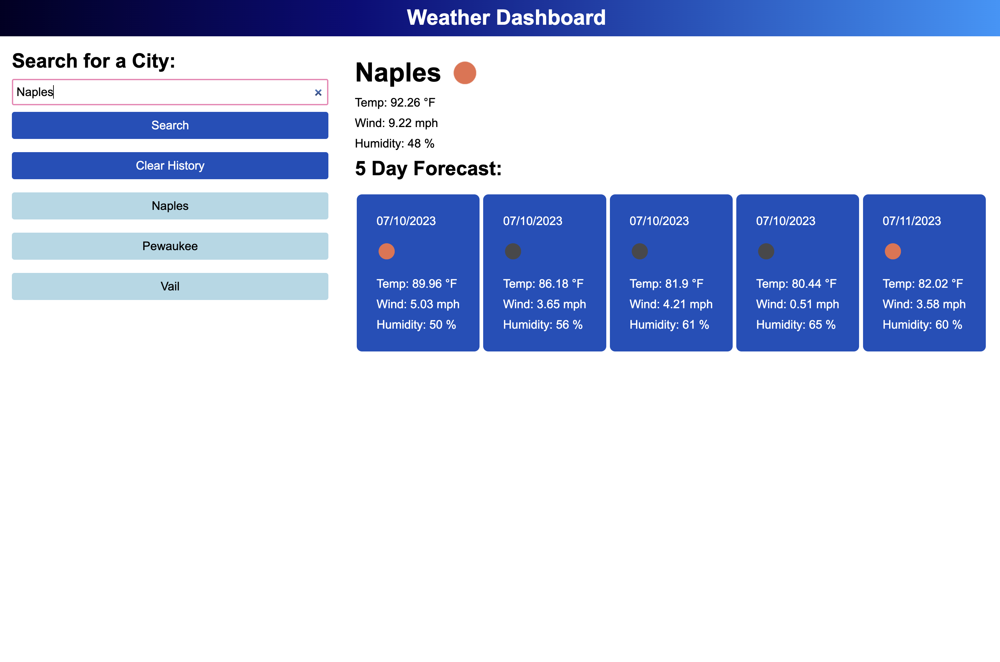

# Weather Dashboard

## Description

This application utilizes the OpenWeather API to retrieve both the current weather and a five day forecast for whatever city the user types in. The app also saves the user's searches for easy access.

## Installation

N/A

## Usage

When the application is first opened, the user can enter a city name into the search bar. Once the search is submitted, the current weather and five day forecast of that city will be displayed.

Each search that the user inputs will be saved and will show beneath the search bar. These past searches are buttons and can be clicked. The buttons will display that city's current weather and five day forecast when clicked. 

The "Clear" button will remove these past searches when clicked.

View screenshot of webpage below:

Link to webpage: https://nstark12.github.io/weather-dashboard/

## Credits

N/A

## License

Please refer to the LICENSE in the repo.